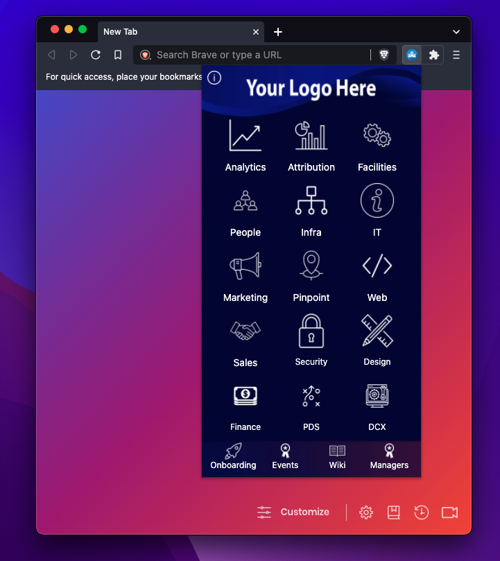

# self-wiki
Written by [Amado Tejada](https://www.linkedin.com/in/amadotejada)

Designed by [Sarah Choi](https://www.linkedin.com/in/sarahleechoi)

Self Wiki is a browser extension used to provide internal company information to employees right from the browser. It also assists with self onboarding and creating IT support tickets.

Self Wiki is in beta and should be tested extensively.

## Supports
- Chrome
- Brave
- Edge

## User Interface

<!-- 

Preview UI Demo

 -->

##
### Disclaimer

This software {Self Wiki} has not been endorsed or supported by any of the software mentioned [above](#supports) and is in no way associated with them and/or its subsidiaries or affiliate.

### License

Self Wiki is released under the [Apache 2.0 License](https://github.com/amadotejada/self-wiki/blob/main/LICENSE)
####
